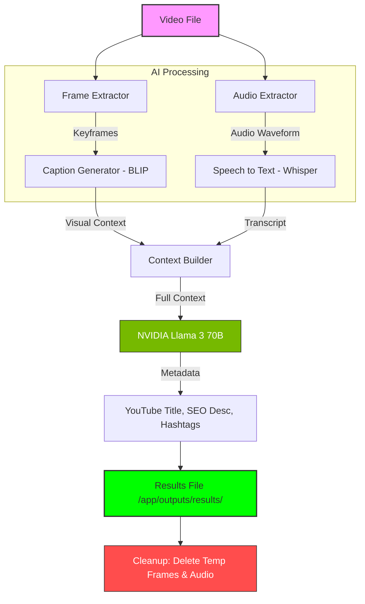

# 🎬 AI-Caption & Viral Content Generator (Video & Image)

AI-Caption is an intelligent multimodal processing pipeline that analyzes both videos and static images to generate viral-ready YouTube metadata, SEO descriptions, and captions.

## 🚀 Overview

The system processes media files through a flexible AI pipeline:
1.  **Video Mode**: Extracts audio (Whisper) and keyframes (BLIP) for full context.
2.  **Image Mode**: Direct visual analysis (BLIP) without audio processing.
3.  **Intelligence Layer**: Aggregates the visual and auditory context to generate SEO-optimized content using **NVIDIA's Llama 3 (70B)**.

---

## ✨ Features

-   **Multi-Platform Ready**: Tailored output for YouTube, Instagram, Facebook, and LinkedIn.
-   **Video Analysis**: Audio Extraction & Speech-to-Text (Whisper).
-   **Image Analysis**: Single-frame captioning for photos.
-   **Visual AI**: Frame Extraction & Image Captioning (BLIP).
-   **SEO Power**: High-CTR Titles and SEO Descriptions via NVIDIA NIM.
-   **Automated Cleanup**: Removes temporary binary files after processing.
-   Automated result logging

---

## 📊 Data Flow Diagram

The following diagram illustrates how data flows through the system:



---

## 🛠️ Tech Stack

-   **LLM**: `meta/llama3-70b-instruct` (via NVIDIA NIM)
-   **Visual Analysis**: `Salesforce/blip-image-captioning-base`
-   **Speech-to-Text**: `OpenAI Whisper (base)`
-   **Video Processing**: OpenCV / MoviePy
-   **Framework**: Python 3.10+

---

## 📁 Project Structure

```text
ai-caption/
├── app/
│   ├── main.py            # Entry point
│   ├── config/            # API keys and settings
│   ├── outputs/           # Generated results
│   └── pipeline/          # Core AI modules
│       ├── orchestrator.py    # Pipeline coordinator
│       ├── frame_extractor.py # Visual processing
│       ├── audio_extractor.py # Audio processing
│       ├── caption_generator.py # Image captioning (BLIP)
│       ├── speech_to_text.py  # Transcription (Whisper)
│       ├── context_builder.py # Context merger
│       └── llm_nvidia.py      # Content generation (Llama 3)
├── requirements.txt       # Dependencies
└── run.py                 # Convenience script
```

---

## 🔧 Setup & Usage

### 1. Requirements
Ensure you have an NVIDIA API key and set it in your `.env` file:
```env
NVIDIA_API_KEY=your_key_here
```

### 2. Installation
```bash
pip install -r requirements.txt
```

### 3. Running the App
```bash
python run.py
```
Enter the path to your video file when prompted (e.g., `sample.mp4`).

---

## 📝 Output
The final result will be saved in `app/outputs/results/` with a timestamped filename, containing:
-   Viral YouTube Title
-   SEO-friendly Description
-   Trending Hashtags
